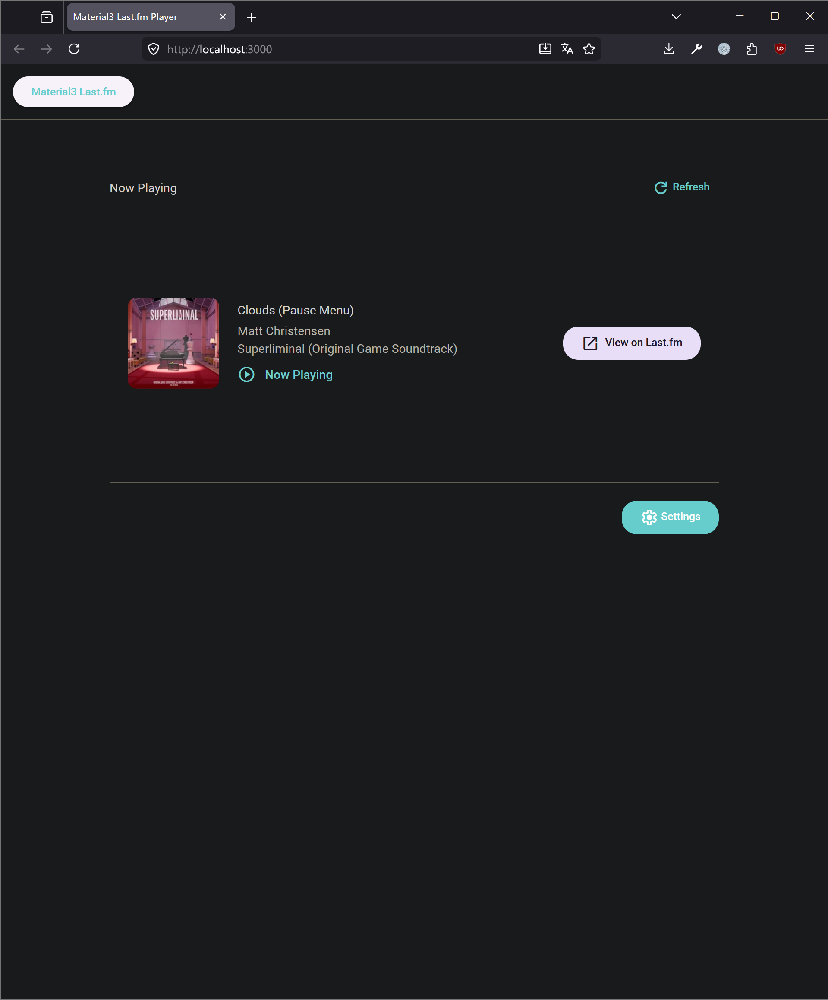

# Material3 Last.fm Now Playing

基于 Vue 3 + Node.js + Material Design Web Components 的网页应用，用于显示 Last.fm 用户正在播放的歌曲。

这个只是作为一个网页端组件来做的小项目，可以将它改造用在各种各样的地方。



## 功能特性

- 显示当前正在播放的歌曲（专辑封面、歌曲名、艺术家、专辑）
- Material Design 3 样式界面，主色调默认 #66CCCC
- 设置页面配置 Last.fm API 密钥和用户名
- **持久化存储**：服务器重启后设置不丢失
- **刷新机制**：
  - 自动刷新（默认7秒）
  - 手动刷新
- 响应式设计，适配移动和桌面设备
- **一键启动脚本**：Windows批处理文件快速启动前后端
- 服务器端API代理，避免CORS问题
- 完整的TypeScript类型支持

## 技术栈

- **前端**: Vue 3 + TypeScript + Vite + Pinia + Vue Router
- **UI 组件**: Material Design Web Components (Material3)
- **后端**: Node.js + Express + TypeScript
- **持久化存储**: 文件系统 (JSON 文件)
- **API 代理**: 通过后端代理 Last.fm API 请求，避免 CORS 问题

## 项目结构

```
vue-material-lastfm/
├── client/                 # Vue 前端
│   ├── src/
│   │   ├── components/    # 可复用组件
│   │   ├── views/        # 页面视图
│   │   ├── stores/       # Pinia 状态管理
│   │   ├── router/       # 路由配置
│   │   └── assets/       # 静态资源
│   ├── index.html
│   ├── vite.config.ts
│   └── package.json
├── server/                # Node.js 后端
│   ├── src/
│   │   └── index.ts      # Express 服务器
│   ├── .env              # 环境变量
│   ├── tsconfig.json
│   └── package.json
├── start-all.bat          # 一键启动脚本
├── start-backend.bat      # 后端启动脚本
├── start-frontend.bat     # 前端启动脚本
└── README.md
```

## 快速开始

### 1. 安装依赖

**前端**:
```bash
cd client
npm install
```

**后端**:
```bash
cd server
npm install
```

### 2. 配置 Last.fm API

1. 前往 [Last.fm API 申请页面](https://www.last.fm/api/account/create) 创建 API 密钥
2. 复制 API 密钥和你的用户名

### 3. 配置环境变量

在 `server/.env` 文件中设置你的 API 密钥和用户名：

```env
LASTFM_API_KEY=your_api_key_here
LASTFM_USERNAME=your_username_here
```

### 4. 启动应用（两种方式）

#### 方式 A：一键启动脚本（推荐）
运行根目录下的 `start-all.bat`，会自动启动后端和前端服务器：
- 后端：http://localhost:3001
- 前端：http://localhost:3000

#### 方式 B：手动启动
**启动后端服务器** (端口 3001):
```bash
cd server
npm run dev
```

**启动前端开发服务器** (端口 3000):
```bash
cd client
npm run dev
```

### 5. 访问应用

打开浏览器访问 http://localhost:3000

首次使用时需要进入设置页面（点击右下角设置按钮）配置 API 密钥和用户名。

## API 端点

- `GET /api/health` - 健康检查
- `GET /api/now-playing` - 获取当前播放的歌曲
- `GET /api/settings` - 获取当前设置
- `POST /api/settings` - 更新设置

## 开发说明

### 前端
- 使用 Material Web Components 作为 UI 基础
- 通过 Vite 代理将 `/api` 请求转发到后端
- 自定义 CSS 变量实现 Material3 主题

### 后端
- Express 服务器处理 API 请求
- 代理 Last.fm API 请求，避免 CORS 问题
- **文件系统持久化存储**：用户设置保存在 `server/dist/settings.json` 文件中，重启后不丢失
- 完整的 TypeScript 类型支持

## 生产环境部署

1. 构建前端：
```bash
cd client
npm run build
```

2. 构建后端：
```bash
cd server
npm run build
```

3. 启动后端服务：
```bash
cd server
npm start
```

4. 使用 Nginx 或类似工具将前端静态文件和后端 API 服务整合。

## 注意事项

- **双重存储机制**：API 密钥和用户名同时存储在浏览器本地存储（localStorage）和服务器端文件系统（`server/dist/settings.json`）中
- **持久化**：服务器重启后设置不会丢失
- **API 频率限制**：Last.fm API 有请求频率限制，自动刷新间隔为7秒以避免超过限制
- **生产环境建议**：生产环境中应考虑更安全的存储方式（如数据库）和 HTTPS 加密传输

## 许可证

MIT
